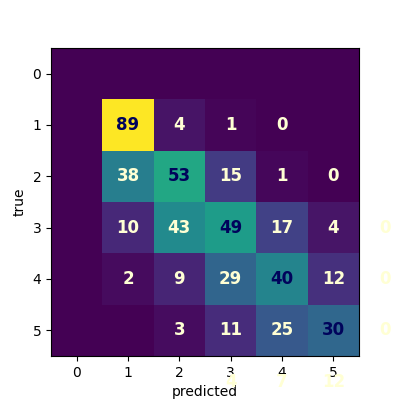

# TODO
Audrey is 16 by 128 Ximg --> npulses.  
Use python library for counting operations/clock cycles per image.  
```https://bnikolic.co.uk/blog/python/flops/2019/09/27/python-counting-events.html```  
And for NNs ```https://bnikolic.co.uk/blog/python/flops/2019/09/27/python-counting-events.html```    

# Running copies 
... against multiple files that came from a number of threads.
```bash
for num in {001..031}; do /nvme0/CookieSimSlim/src/mrs_pacman.py /nvme0/CookieSimSlim_data/css.16x128.coffee-office.$num.h5 & done
```

This leads to the following response from `top`.   
```bash
 750484 coffee    20   0 1848960 365592  62596 R  73.8   1.1   1:20.74 mrs_pacman.py                                                                                                                                                           
 750455 coffee    20   0 1848900 365792  62860 R  58.1   1.1   1:25.49 mrs_pacman.py                                                                                                                                                           
 750480 coffee    20   0 1848836 366192  63328 R  56.8   1.1   1:19.66 mrs_pacman.py                                                                                                                                                           
 750458 coffee    20   0 1848320 365816  63472 R  56.5   1.1   1:21.43 mrs_pacman.py                                                                                                                                                           
 750464 coffee    20   0 1848948 365924  62952 R  53.8   1.1   1:18.90 mrs_pacman.py                                                                                                                                                           
 750475 coffee    20   0 1848760 365716  62928 R  52.8   1.1   1:18.37 mrs_pacman.py                                                                                                                                                           
 750485 coffee    20   0 1848896 365864  62940 R  51.5   1.1   1:19.67 mrs_pacman.py                                                                                                                                                           
 750461 coffee    20   0 1848960 365808  62908 R  50.2   1.1   1:15.21 mrs_pacman.py                                                                                                                                                           
 750466 coffee    20   0 1848796 365556  62732 R  50.2   1.1   1:15.36 mrs_pacman.py                                                                                                                                                           
 750479 coffee    20   0 1848824 365508  62664 R  50.2   1.1   1:15.96 mrs_pacman.py                                                                                                                                                           
 750481 coffee    20   0 1848900 365552  62628 R  50.2   1.1   1:20.77 mrs_pacman.py                                                                                                                                                           
 750482 coffee    20   0 1849088 365736  62628 R  50.2   1.1   1:16.41 mrs_pacman.py                                                                                                                                                           
 750483 coffee    20   0 1848964 365872  62880 R  50.2   1.1   1:16.59 mrs_pacman.py                                                                                                                                                           
 750457 coffee    20   0 1848908 365980  63040 R  49.8   1.1   1:18.57 mrs_pacman.py                                                                                                                                                           
 750459 coffee    20   0 1848944 366188  63204 R  49.8   1.1   1:16.52 mrs_pacman.py                                                                                                                                                           
 750460 coffee    20   0 1848896 366028  63096 R  49.8   1.1   1:16.68 mrs_pacman.py                                                                                                                                                           
 750463 coffee    20   0 1848920 365864  62908 R  49.8   1.1   1:15.56 mrs_pacman.py                                                                                                                                                           
 750465 coffee    20   0 1848912 365780  62932 R  49.8   1.1   1:15.95 mrs_pacman.py                                                                                                                                                           
 750467 coffee    20   0 1848620 365836  63188 R  49.8   1.1   1:16.77 mrs_pacman.py                                                                                                                                                           
 750468 coffee    20   0 1848808 365836  62996 R  49.8   1.1   1:15.89 mrs_pacman.py                                                                                                                                                           
 750470 coffee    20   0 1848588 365504  62880 R  49.8   1.1   1:18.83 mrs_pacman.py                                                                                                                                                           
 750471 coffee    20   0 1848780 365676  62868 R  49.8   1.1   1:16.74 mrs_pacman.py                                                                                                                                                           
 750472 coffee    20   0 1848892 365324  62400 R  49.8   1.1   1:15.93 mrs_pacman.py                                                                                                                                                           
 750474 coffee    20   0 1849032 365848  62796 R  49.8   1.1   1:18.52 mrs_pacman.py                                                                                                                                                           
 750476 coffee    20   0 1848864 365864  62968 R  49.8   1.1   1:17.88 mrs_pacman.py                                                                                                                                                           
 750477 coffee    20   0 1848616 365180  62528 R  49.8   1.1   1:21.03 mrs_pacman.py                                                                                                                                                           
 750478 coffee    20   0 1848812 366208  63360 R  49.8   1.1   1:15.37 mrs_pacman.py                                                                                                                                                           
 750469 coffee    20   0 1848564 365476  62880 R  49.5   1.1   1:19.33 mrs_pacman.py                                                                                                                                                           
 750456 coffee    20   0 1848976 365864  62852 R  49.2   1.1   1:16.81 mrs_pacman.py                                                                                                                                                           
 750473 coffee    20   0 1848928 365732  62776 R  48.8   1.1   1:15.66 mrs_pacman.py                                                                                                                                                           
 750462 coffee    20   0 1848572 365244  62648 R  48.2   1.1   1:20.23 mrs_pacman.py        
```


# Plotting Confusion  
====================


Brief confusion matrix from the mrs\_pacman.py  


# Not parallel for Razib   
========================  
```bash
./src/run_simulation.py -ofname ../CookieSimSlim_data/css.16x128.h5 -n_threads 4 -n_angles 16 -n_energies 128 -n_images 1024 -centralenergy 64 -centralenergyvar 32 -kickstrength 32 -polstrength 1 -polstrengthvar 0 -offset_threads 0
```

# CookieSimSlim  
===============  
Getting better with FFT convolutions...  
```
res = np.fft.ifft(np.fft.fft(f[k]['Ypdf'][()],axis=1)*-1*np.flip(np.fft.fft(f[k]['Ximg'][()],axis=1),axis=1),axis=1)
```

Slim simulator for LCLS-SLAC CookieBox detector.  
Updating for 2023 revivial on S3DF.   


# Parallelism
Now I'm using mpi at home.  Usage is something like this... from directory /mnt/islands where I've moved the code as well, and using hard paths.  \
```bash
mpirun --host baratza:1,java:1,flores:1,timor:1,papua:1,sulawesi:1,sumatra:1,beanbox:1,roaster:1,ethiopia:1,yemen:1,hario:1,burundi:1,rwanda:1 /mnt/islands/CookieSimSlim/src/run_simulation.py -ofname /mnt/islands/CookieSimSlim_data/css.16x128.h5 -n_threads 4 -n_angles 16 -n_energies 128 -n_images 1024 -centralenergy 64 -centralenergyvar 32 -kickstrength 32 -polstrength 1 -polstrengthvar 0 -offset_threads 0
```  

All the workers now ... well not on lipa, she's acting up ...   
```bash
mpirun --host baratza:1,java:1,flores:1,timor:1,papua:1,sulawesi:1,sumatra:1,kona:1,oahu:1,kao:1,batangas:1,amadeo:1,bialetti:1,aeropress:1,beanbox:1,roaster:1,ethiopia:1,yemen:1,hario:1,burundi:1,rwanda:1 /mnt/islands/CookieSimSlim/src/run_simulation.py -ofname /mnt/islands/CookieSimSlim_data/css.16x128.h5 -n_threads 4 -n_angles 16 -n_energies 128 -n_images 1024 -centralenergy 64 -centralenergyvar 32 -kickstrength 32 -polstrength 1 -polstrengthvar 0 -offset_threads 8
```
The reason for using only one slot for the simulation is that it is itself parallel inside the node, and each thread that gets spun up by run\_sim will get its own filename and these collide if mpirun runs multiple jobs on a single node.  
Just a weird quirk of the way I parallelized first across single node and now am also playing with mpirun.  

## The Probability Distribution Function (PDF)  
Possibly need to source the conda environment via something like.

An example of running this for a simple test on two threads with 128 angle channels and 10 images each thread is as follows,  
which in principle should be run as a script (now moving this to ```./test_run.bash```):    
```bash  
opath=/sdf/scratch/${USER}/CookieSimSlim_data  
mkdir -p ${opath}  
outfile=${opath}/test.h5  
./src/run_simulation.py -ofname ${outfile} -n_threads 16 -n_images 100 -n_angles 128 -n_energies 512 -polstrength 1 -polstrengthvar 1 -centralenergy 256 -centralenergyvar 128 -kickstrength 128 -kickstrengthvar 64 -drawscale 8
```  

## HDF5 file structure  
.h5 file structure: 
* image	-- still setting the key as a hash to avoiding collision since could be adding images to existing file.... though really unlikely since using PID in filename to avoid fileaccess collisions.  
This may need revisiting... maybe each file update would start a new dataset with a new rngseed?
	* Xhits (N,)  
	* Xaddresses (nangles,)  
	* Xnedges (nangles,)  
	* Ximg (nangles,128)  
	* Ypdf (nangles,128)  
	* words (*developmental*)  
	* attrs  
		* sasecenters = [list of sase spike energies]
		* sasephases = [list of sase spike times(sinogram phases)]
		* saseamps = [list of sase spike amplitudes]
		* nangles = 128   
		* nenergies = 512  
		* drawscale = 8 
		* darkscale = 0.001
		* secondaryscale = 0.01
		* Test = bool
		* Train = bool  
* image  
* image  


# ONLY FOR GRAPHCORE
## Collecting images
In order to make the output more managable, there is a script 
```bash
/src/collect_images -mike True -ifnames <list of .h5 filenames to process into individual Train and Test .h5 files>
```
The output should be two files per input filename, using the front of the filename from the list and segregating the Train and Test into consistently named seperate files.  
In each file, there will be a pair of datasets, one for Ytrain,Xtrain and Ytest,Xtest respectively for train and test files.  
*Please keep in mind, these output files are written into the same directory as the source data, just with the added 'Train.h5' or 'Test.h5' extensions.*  
Mike, this ```-mike True``` makes the output have the shape that you wanted, e.g. (Nimages,nangles,nenergies).  Hopefully this is right for you (e.g. old Naoufal geometry).  

What this means in practice is that when running collect\_images.py, one must supply the narrow-ish glob of input filenames, .e.g,
```bash
./src/run_simulation.py -ofname ~/data/CookieSimSlim_data/runfew.h5 -n_threads 4 -n_angles 32 -n_energies 128 -n_images 100 -drawscale 0.2
./src/collect_images.py -mike True -ifnames ~/data/CookieSimSlim_data/runfew.[01][0-9].h5
```
*Also note in example, using only 32 angles rather than square 128x128 images.*


# bitstring representation  
With the aim of moving toward transformer models like BERT or GPT-2, I have started storing also the bitstring representation of each angle.  
This is stored in the simulation output .h5 file as the key 'words' with the intention that the 'words' for a sentence and we intend to mask out words (e.g. specific angles) and then pre-train the transformer based on the loss between the actual masked words and the predicted.  
This function doesn't exist yet, but we are anticipating that we will run with bitstrings that are nenergies bits long for each angle.  
The nenergies bits are divided into a list of nenergies//64 +1 words such that each word is embedded as a 64 bit integer which is a native type available to h5py.  

In the figure we show a comparison of this decoded and plotted set-bit map along side the corresponding 'Ximg'.  

As one can see, the correspondence is excellent except for the undercounting bins that have more than one electron count in the energy bin for a given angle.  
We note that this will actually be rare for high-rate operations of hte FEL, and as well we have access to the 'overcounting' attribute for a given shot.  
The overcounting attribute will be the number of times the encode operation tried to add one to an already set bit.  
When overcounting is found, experimentally, then one would increase the resolution in energy via more nenergies for the same total energy window.  


## Reducing dimensionality  

To reduce dimensionality, using a 2D dct and taking the variance over all the keys in a single .h5 file.  Then using that variance and cutting it at the 0.01 of max variance in the dct coeffs (see ./src/testDCTresolution.py).  This mask is then used on the individual images which are then back transformed for comparison to both raw (left) and truth (right)


